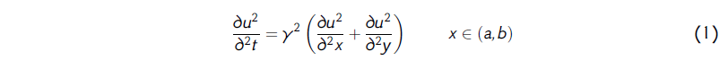
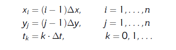
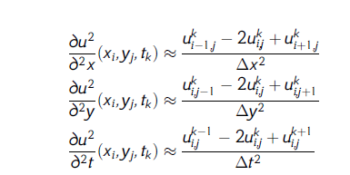
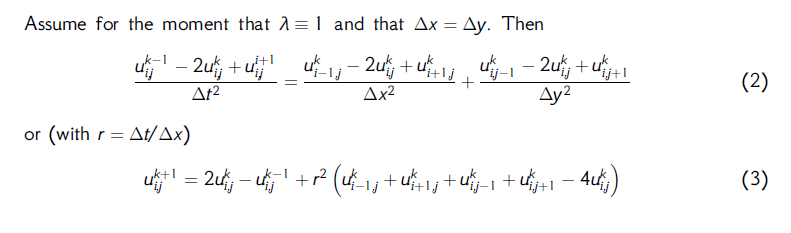

# The Wave Equation 2D

## Discretisation of 2D Wave Equation

Mathematical model of the wave equation 2-dimension

This is a time- and space-dependent problem

Introduce a grid in space-time

Central difference approximations

## Solution

Example when:

	-	we start in the corner

	-	we start in the middle

## Bibliography
**Author:** *Knut_Andreas_Lie*

**Title:** *The Wave Equation in 1D and 2D*

**URL:** http://www.uio.no/studier/emner/matnat/ifi/INF2340/v05/foiler/sim04.pdf
